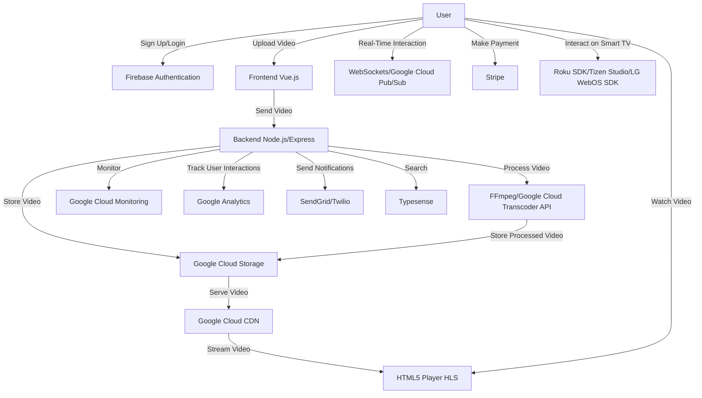

# VOD Platform

# System Typography

## 1. Frontend Development

### Technologies
- **Vue.js**: For building the web frontend.
- **Vue Router**: For client-side routing.
- **Vuex**: For state management.
- **Axios**: For making HTTP requests.

### Tools
- **Vite**: For module bundling and development server.
- **Babel**: For JavaScript transpiling.
- **ESLint**: For code linting.

## 2. Backend Development

### Technologies
- **Node.js**: For building the backend server.
- **Express.js**: For creating the RESTful API.
- **Socket.io**: For real-time communication (if needed).

### Tools
- **Nodemon**: For automatic server restarts during development.
- **PM2**: For process management in production.

## 3. Database

### Services
- **Google Cloud Firestore**: NoSQL database service.

## 4. Video Processing

### Tools
- **FFmpeg**: For video encoding and segmenting.
- **Google Cloud Transcoder API**: For transcoding videos into multiple bitrates and resolutions.

## 5. Storage

### Services
- **Google Cloud Storage**: For storing video files and other assets.

## 6. Content Delivery Network (CDN)

### Services
- **Google Cloud CDN**: For distributing video content globally.
- **Cloudflare**: Alternative CDN service.

## 7. Authentication and Authorization

### Services
- **Firebase Authentication**: For user authentication.

## 8. Real-Time Interaction

### Technologies
- **WebSockets**: For real-time communication.
- **Google Cloud Pub/Sub**: For real-time messaging.

## 9. Deployment and Hosting

### Services
- **Google Cloud Run**: For deploying containerized applications.
- **Google Kubernetes Engine (GKE)**: For orchestrating containerized applications.
- **Firebase Hosting**: For hosting the frontend application.
- **Google App Engine**: Alternative for hosting backend services.

## 10. Monitoring and Analytics

### Services
- **Google Cloud Monitoring**: For monitoring the health of your infrastructure.
- **Google Analytics**: For tracking user interactions.
- **Datadog**: Alternative monitoring service.

## 11. Payment Processing

### Services
- **Stripe**: For handling payments and subscriptions.
- **PayPal**: Alternative payment processing service.

## 12. Roku and Smart TV Development

### Tools and SDKs
- **Roku SDK**: For developing Roku channels.
- **BrightScript**: Programming language for Roku development.
- **Tizen Studio**: For developing Samsung Smart TV apps.
- **LG WebOS SDK**: For developing LG Smart TV apps.

## 13. Third-Party Services

### Services
- **SendGrid**: For sending transactional emails.
- **Twilio**: For SMS notifications.
- **Typesense**: For search functionality.

# Example Architecture

## Frontend (Vue.js)
- **Vue.js**: Main framework.
- **Vue Router**: Routing.
- **Vuex**: State management.
- **Axios**: HTTP requests.
- **Firebase Hosting**: Hosting the frontend.

## Backend (Node.js)
- **Node.js**: Main runtime.
- **Express.js**: RESTful API.
- **Google Cloud Run**: Hosting the backend.

## Database
- **Google Cloud Firestore**: Managed database service.

## Video Processing
- **FFmpeg**: Local video processing.
- **Google Cloud Transcoder API**: Cloud-based video processing.

## Storage
- **Google Cloud Storage**: Storing video files.

## CDN
- **Google Cloud CDN**: Distributing video content.

## Authentication
- **Firebase Authentication**: User authentication.

## Real-Time Interaction
- **Socket.io**: Real-time communication.
- **Google Cloud Pub/Sub**: Messaging.

## Monitoring and Analytics
- **Google Cloud Monitoring**: Infrastructure monitoring.
- **Google Analytics**: User analytics.

## Payment Processing
- **Stripe**: Payment handling.

## Roku and Smart TV Development
- **Roku SDK**: Developing Roku channels.
- **Tizen Studio**: Developing Samsung Smart TV apps.
- **LG WebOS SDK**: Developing LG Smart TV apps.

# System Workflow

1. **User Authentication**: Users sign up or log in using Firebase Authentication.
2. **Video Upload**: Content creators upload videos to the platform.
3. **Video Processing**: Uploaded videos are processed using FFmpeg and Google Cloud Transcoder API to generate multiple bitrates and resolutions.
4. **Storage**: Processed videos are stored in Google Cloud Storage.
5. **Content Delivery**: Videos are delivered to users via Google Cloud CDN.
6. **Playback**: Users can stream videos using an HTML5 player with HLS support.
7. **Real-Time Interaction**: Users can interact in real-time using WebSockets and Google Cloud Pub/Sub.
8. **Monitoring and Analytics**: The platform is monitored using Google Cloud Monitoring and user interactions are tracked using Google Analytics.
9. **Payment Processing**: Payments and subscriptions are handled using Stripe.

# Mermaid Diagram



# Detailed Steps

1. **User Authentication**
    - Users sign up or log in using Firebase Authentication.
    - Firebase Authentication handles user management and authentication.

2. **Video Upload**
    - Content creators upload videos through the frontend built with Vue.js.
    - The frontend sends the video file to the backend.

3. **Video Processing**
    - The backend, built with Node.js and Express, receives the video file.
    - The video is processed using FFmpeg for local processing or Google Cloud Transcoder API for cloud-based processing.
    - Multiple bitrates and resolutions are generated for adaptive streaming.

4. **Storage**
    - Processed videos are stored in Google Cloud Storage.
    - The storage service ensures durability and availability of video files.

5. **Content Delivery**
    - Videos are delivered to users via Google Cloud CDN.
    - The CDN caches video content at edge locations to reduce latency and improve streaming performance.

6. **Playback**
    - Users can stream videos using an HTML5 player with HLS support.
    - The player fetches the video segments from the CDN and plays them back to the user.

7. **Real-Time Interaction**
    - Users can interact in real-time using WebSockets for direct communication.
    - Google Cloud Pub/Sub is used for messaging and notifications.

8. **Monitoring and Analytics**
    - The platform is monitored using Google Cloud Monitoring to ensure the health and performance of the infrastructure.
    - User interactions and analytics are tracked using Google Analytics.

9. **Payment Processing**
    - Payments and subscriptions are handled using Stripe.
    - Stripe manages payment processing, billing, and subscription management.

# Notes

## AI-Based Content Moderation

### Google Cloud Video Intelligence API

You can use the Google Cloud Video Intelligence API to analyze video content and detect explicit content, violence, and other sensitive material.

```javascript
const videoIntelligence = require('@google-cloud/video-intelligence').v1;
const client = new videoIntelligence.VideoIntelligenceServiceClient();

async function analyzeVideo(uri) {
  const request = {
    inputUri: uri,
    features: ['EXPLICIT_CONTENT_DETECTION'],
  };

  const [operation] = await client.annotateVideo(request);
  const [operationResult] = await operation.promise();

  const explicitContentResults = operationResult.annotationResults[0].explicitAnnotation;
  explicitContentResults.frames.forEach(frame => {
    console.log(`Time: ${frame.timeOffset.seconds || 0}.${(frame.timeOffset.nanos / 1e6).toFixed(0)}s`);
    console.log(`Pornography likelihood: ${frame.pornographyLikelihood}`);
  });
}

analyzeVideo('gs://your-bucket/your-video-file.mp4');
